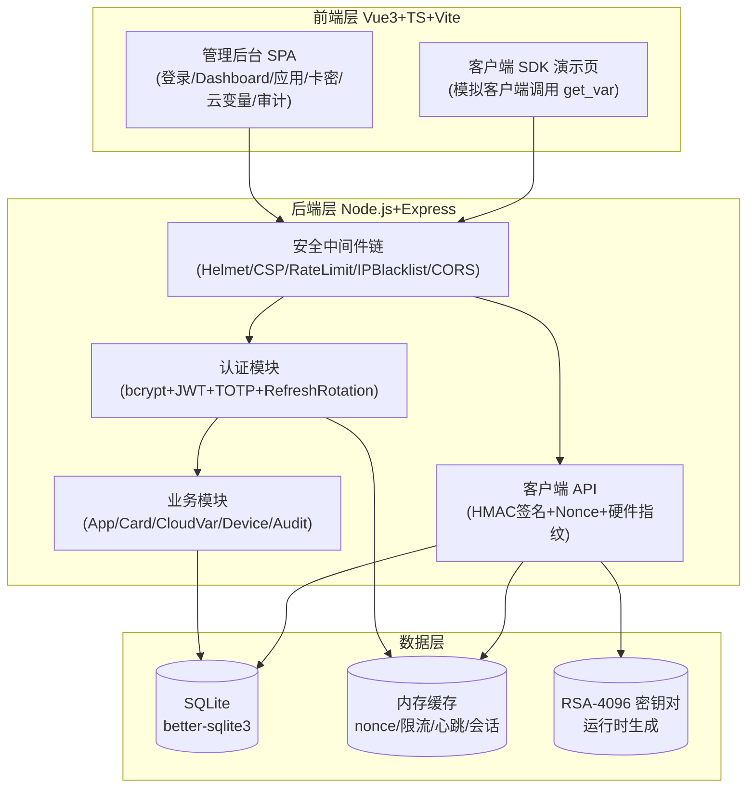

# 网页版云注入平台 - 技术架构文档

## 1. 架构设计



## 2. 技术选型

| 层级 | 技术 | 版本 | 说明 |
|------|------|------|------|
| 前端框架 | Vue 3 + TypeScript | 3.4+ | 与原项目一致，组合式 API |
| 构建工具 | Vite | 5.x | 极速 HMR |
| UI 库 | Element Plus | 2.x | 与原项目一致 |
| 状态管理 | Pinia | 2.x | 与原项目一致 |
| 路由 | Vue Router | 4.x | 与原项目一致 |
| 图表 | ECharts | 5.x | 趋势图 |
| HTTP 客户端 | Axios | 1.x | 拦截器统一处理 401 |
| 二维码 | qrcode | 1.x | 2FA QR 码 |
| 后端框架 | Express | 4.x | 稳定成熟 |
| 数据库 | SQLite + better-sqlite3 | 11.x | 零外部依赖，参数化查询防 SQL 注入 |
| 密码哈希 | bcrypt | 5.x | cost=12 |
| JWT | jsonwebtoken | 9.x | HS256 + jti |
| TOTP | otplib | 12.x | RFC 6238 |
| 加密 | Node crypto 内置 | - | AES-256-GCM / HMAC-SHA256 / RSA-4096 |
| 限流 | express-rate-limit | 7.x | 多维度限流 |
| 安全头 | helmet | 7.x | CSP/HSTS 等 |
| 日志 | pino | 8.x | 结构化日志 |

## 3. 路由定义

### 3.1 前端路由

| 路由 | 用途 | 权限 |
|------|------|------|
| `/login` | 登录页 | 公开 |
| `/dashboard` | 工作台 | 已登录 |
| `/apps` | 应用管理 | 已登录 |
| `/cards` | 卡密管理 | 已登录 |
| `/cloud-vars` | 云注入变量 | 已登录 |
| `/devices` | 设备/会话 | 已登录 |
| `/audit-logs` | 审计日志 | 已登录 |
| `/security` | 安全中心 | 已登录 |
| `/sdk-demo` | 客户端 SDK 演示 | 公开（演示用） |

### 3.2 后端 API 路由

| 路由 | 方法 | 用途 | 鉴权 |
|------|------|------|------|
| `/api/v1/auth/login` | POST | 登录（含 2FA） | 公开+限流 |
| `/api/v1/auth/refresh` | POST | 刷新 token | refresh token |
| `/api/v1/auth/logout` | POST | 登出 | access token |
| `/api/v1/profile/me` | GET | 当前用户信息 | access token |
| `/api/v1/profile/password` | PUT | 修改密码 | access token |
| `/api/v1/profile/2fa/setup` | POST | 启用 2FA 生成密钥 | access token |
| `/api/v1/profile/2fa/verify` | POST | 验证 2FA 启用 | access token |
| `/api/v1/profile/2fa/disable` | POST | 禁用 2FA | access token |
| `/api/v1/admin/users` | GET/POST | 用户管理 | admin |
| `/api/v1/admin/dashboard` | GET | 管理员工作台 | admin/tenant |
| `/api/v1/apps` | GET/POST/PUT/DELETE | 应用 CRUD | access token |
| `/api/v1/apps/:id/rotate-secret` | POST | 密钥轮换 | access token |
| `/api/v1/cards` | GET/POST/DELETE | 卡密管理 | access token |
| `/api/v1/cards/batch` | POST | 批量生成 | access token |
| `/api/v1/cards/:id/ban` | POST | 封禁卡密 | access token |
| `/api/v1/cloud-vars` | GET/POST/PUT/DELETE | 云变量 CRUD | access token |
| `/api/v1/devices` | GET | 设备列表 | access token |
| `/api/v1/devices/:id/kick` | POST | 强制下线 | access token |
| `/api/v1/audit-logs/login` | GET | 登录日志 | access token |
| `/api/v1/audit-logs/operation` | GET | 操作日志 | access token |
| `/api/v1/audit-logs/verify` | GET | 验证日志 | access token |
| `/api/v1/security/ip-blacklist` | GET/POST/DELETE | IP 黑名单 | admin |
| `/api/v1/client/login` | POST | 客户端登录（卡密+硬件绑定） | HMAC 签名 |
| `/api/v1/client/heartbeat` | POST | 心跳保活 | HMAC 签名 |
| `/api/v1/client/get_var` | POST | 获取云变量（核心注入接口） | HMAC 签名 |
| `/api/v1/client/logout` | POST | 客户端登出 | HMAC 签名 |

## 4. 数据库设计

### 4.1 核心表

```sql
-- 用户表
CREATE TABLE users (
  id INTEGER PRIMARY KEY AUTOINCREMENT,
  username TEXT UNIQUE NOT NULL,
  password_hash TEXT NOT NULL,           -- bcrypt cost=12
  role TEXT NOT NULL CHECK(role IN ('admin','tenant')),
  totp_secret TEXT,                       -- AES-256-GCM 加密
  totp_enabled INTEGER DEFAULT 0,
  totp_backup_codes TEXT,                 -- JSON: 10 个 bcrypt 哈希
  status TEXT DEFAULT 'active',
  last_login_at INTEGER,
  last_login_ip TEXT,
  created_at INTEGER NOT NULL,
  updated_at INTEGER NOT NULL
);

-- 应用表
CREATE TABLE apps (
  id INTEGER PRIMARY KEY AUTOINCREMENT,
  user_id INTEGER NOT NULL REFERENCES users(id),
  name TEXT NOT NULL,
  app_key TEXT UNIQUE NOT NULL,           -- 32 字符随机
  app_secret TEXT NOT NULL,               -- AES-256-GCM 加密
  sign_secret TEXT NOT NULL,              -- AES-256-GCM 加密
  status TEXT DEFAULT 'active',
  created_at INTEGER NOT NULL,
  updated_at INTEGER NOT NULL
);

-- 卡密表
CREATE TABLE cards (
  id INTEGER PRIMARY KEY AUTOINCREMENT,
  app_id INTEGER NOT NULL REFERENCES apps(id),
  card_key TEXT UNIQUE NOT NULL,          -- 32 字符
  card_type TEXT NOT NULL CHECK(card_type IN ('duration','count','permanent','trial','feature')),
  duration_days INTEGER,                  -- duration 类型用
  max_count INTEGER,                      -- count 类型用
  used_count INTEGER DEFAULT 0,
  features TEXT,                          -- feature 类型用，JSON
  status TEXT DEFAULT 'unused' CHECK(status IN ('unused','active','expired','banned','used_up')),
  bound_hardware TEXT,                    -- SHA-256 指纹
  bound_at INTEGER,
  expires_at INTEGER,
  last_heartbeat_at INTEGER,
  created_at INTEGER NOT NULL,
  updated_at INTEGER NOT NULL
);

-- 云变量表（核心）
CREATE TABLE cloud_vars (
  id INTEGER PRIMARY KEY AUTOINCREMENT,
  app_id INTEGER NOT NULL REFERENCES apps(id),
  var_key TEXT NOT NULL,
  var_value TEXT NOT NULL,                -- AES-256-GCM 加密
  var_type TEXT DEFAULT 'string' CHECK(var_type IN ('string','number','json','bool')),
  description TEXT,
  read_only INTEGER DEFAULT 0,
  status TEXT DEFAULT 'active',
  version INTEGER DEFAULT 1,              -- 版本号，每次更新自增
  created_at INTEGER NOT NULL,
  updated_at INTEGER NOT NULL,
  UNIQUE(app_id, var_key)
);

-- 审计日志（登录）
CREATE TABLE audit_log_login (
  id INTEGER PRIMARY KEY AUTOINCREMENT,
  user_id INTEGER,
  username TEXT,
  ip TEXT,
  user_agent TEXT,
  success INTEGER,
  fail_reason TEXT,
  created_at INTEGER NOT NULL
);
CREATE INDEX idx_audit_login_user ON audit_log_login(user_id, created_at DESC);
CREATE INDEX idx_audit_login_ip ON audit_log_login(ip, created_at DESC);

-- 审计日志（操作）
CREATE TABLE audit_log_operation (
  id INTEGER PRIMARY KEY AUTOINCREMENT,
  user_id INTEGER NOT NULL,
  username TEXT,
  action TEXT NOT NULL,                   -- 如 card.create / cloud_var.update
  target_type TEXT,
  target_id TEXT,
  detail TEXT,                            -- JSON
  ip TEXT,
  created_at INTEGER NOT NULL
);
CREATE INDEX idx_audit_op_user ON audit_log_operation(user_id, created_at DESC);

-- 审计日志（客户端验证）
CREATE TABLE audit_log_verify (
  id INTEGER PRIMARY KEY AUTOINCREMENT,
  app_id INTEGER,
  card_key TEXT,
  action TEXT,                            -- login/heartbeat/get_var
  ip TEXT,
  success INTEGER,
  fail_reason TEXT,
  created_at INTEGER NOT NULL
);
CREATE INDEX idx_audit_verify_app ON audit_log_verify(app_id, created_at DESC);

-- IP 黑名单
CREATE TABLE ip_blacklist (
  id INTEGER PRIMARY KEY AUTOINCREMENT,
  ip TEXT UNIQUE NOT NULL,
  reason TEXT,
  expires_at INTEGER,                     -- NULL 永久
  created_by INTEGER,
  created_at INTEGER NOT NULL
);

-- Refresh Token 黑名单（jti 撤销）
CREATE TABLE revoked_tokens (
  jti TEXT PRIMARY KEY,
  user_id INTEGER,
  expires_at INTEGER,
  created_at INTEGER NOT NULL
);

-- 登录失败记录（用于自动锁定）
CREATE TABLE login_failures (
  id INTEGER PRIMARY KEY AUTOINCREMENT,
  username TEXT,
  ip TEXT,
  created_at INTEGER NOT NULL
);
CREATE INDEX idx_login_fail_user ON login_failures(username, created_at DESC);
CREATE INDEX idx_login_fail_ip ON login_failures(ip, created_at DESC);
```

## 5. 关键安全实现细节

### 5.1 JWT 实现

```typescript
// access token: 15min, subject="access"
// refresh token: 7d, subject="refresh"
// 校验时强制检查 subject，防 refresh 越权
function signAccessToken(user) {
  return jwt.sign(
    { sub: user.id, role: user.role, username: user.username, jti: uuid() },
    JWT_SECRET,
    { expiresIn: '15m', subject: 'access', algorithm: 'HS256' }
  );
}
```

### 5.2 HMAC 签名校验（客户端 API）

```typescript
// 客户端签名：HMAC-SHA256(SignSecret, method + "\n" + path + "\n" + timestamp + "\n" + nonce + "\n" + bodyMd5)
// 服务端校验顺序：
//   1. timestamp 偏差 ≤ 300s
//   2. nonce 未使用（写入 cache 5min TTL）
//   3. 重算 HMAC 比对（防时序攻击用 timingSafeEqual）
//   4. 校验 AppKey 存在 + 卡密有效
```

### 5.3 AES-256-GCM 加密

```typescript
// 每条数据独立 IV（12 字节随机），密文格式：base64(iv || ciphertext || authTag)
function encrypt(plaintext, key) {
  const iv = crypto.randomBytes(12);
  const cipher = crypto.createCipheriv('aes-256-gcm', key, iv);
  const enc = Buffer.concat([cipher.update(plaintext, 'utf8'), cipher.final()]);
  const tag = cipher.getAuthTag();
  return Buffer.concat([iv, enc, tag]).toString('base64');
}
```

### 5.4 硬件指纹绑定

```typescript
// 客户端收集 CPU ID + MAC + Disk Serial → SHA-256
// 首次 login 时绑定到卡密，后续请求必须匹配
// 卡密封禁时联动心跳 Redis 删除（强制下线）
```

### 5.5 限流策略

| 端点 | 限制 | 维度 |
|------|------|------|
| `/api/v1/auth/login` | 5 次/分钟 | IP + 用户名 |
| `/api/v1/auth/refresh` | 10 次/分钟 | IP |
| `/api/v1/client/*` | 60 次/分钟 | AppKey |
| `/api/v1/admin/*` | 100 次/分钟 | 用户 |
| 其他 | 30 次/分钟 | IP |

## 6. 项目目录结构

```
cloud-injection/
├── apps/
│   ├── server/                    # 后端
│   │   ├── src/
│   │   │   ├── config/            # 配置（env + 默认值）
│   │   │   ├── db/                # SQLite 初始化 + 迁移
│   │   │   ├── middleware/        # auth/ratelimit/ipBlacklist/signature
│   │   │   ├── modules/           # auth/app/card/cloudVar/device/audit/security/client
│   │   │   ├── utils/             # crypto/jwt/totp/logger
│   │   │   ├── app.ts             # Express app 装配
│   │   │   └── index.ts           # 入口
│   │   ├── package.json
│   │   └── tsconfig.json
│   └── admin/                     # 前端
│       ├── src/
│       │   ├── api/               # axios 封装
│       │   ├── components/        # 通用组件
│       │   ├── layouts/           # 主布局
│       │   ├── router/            # 路由 + 守卫
│       │   ├── stores/            # Pinia
│       │   ├── views/             # 页面
│       │   ├── App.vue
│       │   └── main.ts
│       ├── index.html
│       ├── package.json
│       ├── tsconfig.json
│       └── vite.config.ts
├── data/                          # SQLite 数据文件（运行时生成）
├── keys/                          # RSA 密钥对（运行时生成）
├── package.json                   # workspace 根
└── README.md
```

## 7. 部署与运行

```bash
# 开发模式（前后端分离）
cd cloud-injection
npm install
npm run dev            # 同时启动前后端

# 生产模式（前端构建后由后端静态托管）
npm run build
npm start              # 单进程提供 API + 静态资源
```

## 8. 测试账号

首次启动自动初始化：
- 用户名：`admin`
- 密码：`admin123`（首次登录强制改密）
- 2FA：未启用（登录后到「安全中心」启用）
